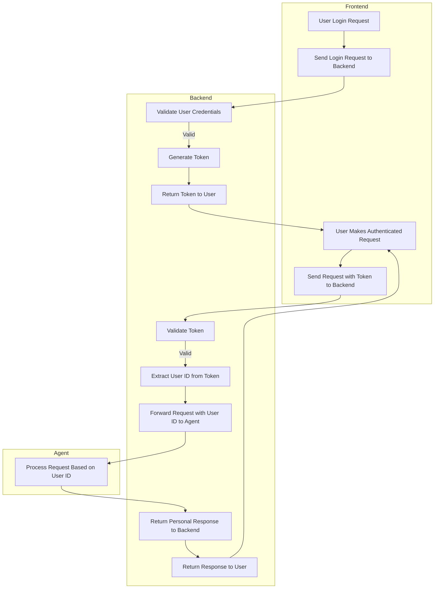

## Request & Response Examples

The server provides a simple layer for managing agent processes.

### API Resources

- [POST /start](#post-start)
- [POST /stop](#post-stop)
- [POST /ping](#post-ping)
- [POST /users](#post-users)
- [PUT /users/:id](#put-usersid)
- [DELETE /users/:id](#delete-usersid)
- [POST /login](#post-login)
- [POST /logout](#post-logout)
- [POST /register](#post-register)

### POST /start

This API starts an agent with the given graph and override properties. The started agent will join the specified channel and subscribe to the UID that your browser/device's RTC uses to join.

| Param        | Description                                                                                                                                                                                                                                                                                               |
| ------------ | --------------------------------------------------------------------------------------------------------------------------------------------------------------------------------------------------------------------------------------------------------------------------------------------------------- |
| request_id   | Any UUID for tracing purposes.                                                                                                                                                                                                                                                                            |
| channel_name | Channel name, it needs to be the same as the one your browser/device joins. The agent needs to stay with your browser/device in the same channel to communicate.                                                                                                                                          |
| user_uid     | The UID that your browser/device's RTC uses to join. The agent needs to know your RTC UID to subscribe to your audio.                                                                                                                                                                                     |
| bot_uid      | Optional, the UID the bot uses to join RTC.                                                                                                                                                                                                                                                               |
| graph_name   | The graph to be used when starting the agent, will be found in `property.json`.                                                                                                                                                                                                                           |
| properties   | Additional properties to override in `property.json`. The override will not change the original `property.json`, only the one the agent uses to start.                                                                                                                                                    |
| timeout      | Determines how long the agent will remain active without receiving any pings. If the timeout is set to `-1`, the agent will not terminate due to inactivity. By default, the timeout is set to 60 seconds, but this can be adjusted using the `WORKER_QUIT_TIMEOUT_SECONDS` variable in your `.env` file. |

Example:

```bash
curl 'http://localhost:8080/start' \
  -H 'Content-Type: application/json' \
  --data-raw '{
    "request_id": "c1912182-924c-4d15-a8bb-85063343077c",
    "channel_name": "test",
    "user_uid": 176573,
    "graph_name": "camera_va_openai_azure",
    "properties": {
      "openai_chatgpt": {
        "model": "gpt-4o"
      }
    }
  }'
```

### POST /stop

This api stops the agent you started

| Param        | Description                                       |
| ------------ | ------------------------------------------------- |
| request_id   | any uuid for tracing purpose                      |
| channel_name | channel name, the one you used to start the agent |

Example:

```bash
curl 'http://localhost:8080/stop' \
  -H 'Content-Type: application/json' \
  --data-raw '{
    "request_id": "c1912182-924c-4d15-a8bb-85063343077c",
    "channel_name": "test"
  }'
```

### POST /ping

This api sends a ping to the server to indicate connection is still alive. This is not needed if you specify `timeout:-1` when starting the agent, otherwise the agent will quit if not receiving ping after timeout in seconds.

| Param        | Description                                       |
| ------------ | ------------------------------------------------- |
| request_id   | any uuid for tracing purpose                      |
| channel_name | channel name, the one you used to start the agent |

Example:

```bash
curl 'http://localhost:8080/ping' \
  -H 'Content-Type: application/json' \
  --data-raw '{
    "request_id": "c1912182-924c-4d15-a8bb-85063343077c",
    "channel_name": "test"
  }'
```

### POST /users

Create a new user.

| Param    | Description          |
| -------- | -------------------- |
| name     | Name of the user     |
| email    | Email of the user    |
| password | Password of the user |

Example:

```bash
curl -X POST -H "Content-Type: application/json" \
-d '{"name":"Alice","email":"alice@example.com","password":"1234"}' \
http://localhost:8080/users
```

### PUT /users/:id

Update an existing user.

| Param    | Description          |
| -------- | -------------------- |
| name     | Name of the user     |
| email    | Email of the user    |
| password | Password of the user |

Example:

```bash
curl -X PUT -H "Content-Type: application/json" \
-d '{"name":"Alice Updated","email":"alice@example.com","password":"9876"}' \
http://localhost:8080/users/<USER_ID>
```

### DELETE /users/:id

Archive a user.

Example:

```bash
curl -X DELETE http://localhost:8080/users/<USER_ID>
```

### POST /login

Log in a user.

| Param    | Description          |
| -------- | -------------------- |
| email    | Email of the user    |
| password | Password of the user |

Example:

```bash
curl -X POST -H "Content-Type: application/json" \
-d '{"email":"alice@example.com","password":"1234"}' \
http://localhost:8080/login
```

### POST /logout

Log out a user.

| Header        | Description      |
| ------------- | ---------------- |
| Authorization | Token from login |

Example:

```bash
curl -X POST -H "Authorization: <TOKEN_FROM_LOGIN>" http://localhost:8080/logout
```

### POST /register

Register a new user.

| Param    | Description          |
| -------- | -------------------- |
| name     | Name of the user     |
| email    | Email of the user    |
| password | Password of the user |

Example:

```bash
curl -X POST -H "Content-Type: application/json" \
-d '{"name":"Bob","email":"bob@example.com","password":"abcd"}' \
http://localhost:8080/register
```

### POST /token/verify

Verify a token.

| Header        | Description      |
| ------------- | ---------------- |
| Authorization | Token from login |

Example:

```bash
curl -X POST -H "Authorization: <TOKEN_FROM_LOGIN>" http://localhost:8080/token/verify
```

## User management

### Data Model

Create a `User` struct with fields such as `ID`, `name`, `email`, `passwordHash`, `isArchived`, etc. Define a `UserStore` interface for easy swapping of storage implementations.

### In-Memory Store

Implement the `UserStore` interface using a map or `sync.Map`.

### Service Layer

Provide functions for creating, updating, archiving, logging in, logging out, and registering users.

### HTTP Handlers

Bind request data, call service methods, and output JSON responses.

### Routes

- `POST /users` - Create a user
- `PUT /users/:id` - Update a user
- `DELETE /users/:id` - Archive a user
- `POST /login` - Log in a user
- `POST /logout` - Log out a user
- `POST /register` - Register a user

### Test

#### Create User

```bash
curl -X POST -H "Content-Type: application/json" -d '{"name":"Alice","email":"alice@example.com","password":"1234"}' http://localhost:8080/users
```

#### Get User

```bash
curl -X GET http://localhost:8080/users/<USER_ID>
```

#### Update User

```bash
curl -X PUT -H "Content-Type: application/json" -d '{"name":"Alice Updated","email":"alice@example.com","password":"9876"}' http://localhost:8080/users/<USER_ID>
```

#### Archive User

```bash
curl -X DELETE http://localhost:8080/users/<USER_ID>
```

#### Register User

```bash
curl -X POST -H "Content-Type: application/json" -d '{"name":"Bob","email":"bob@example.com","password":"abcd"}' http://localhost:8080/register
```

#### Login

```bash
curl -X POST -H "Content-Type: application/json" -d '{"email":"alice@example.com","password":"1234"}' http://localhost:8080/login
```

#### Logout

```bash
curl -X POST -H "Authorization: <TOKEN_FROM_LOGIN>" http://localhost:8080/logout
```

#### Verify Token

```bash
curl -X POST -H "Authorization: <TOKEN_FROM_LOGIN>" http://localhost:8080/token/verify
```

### Flow


