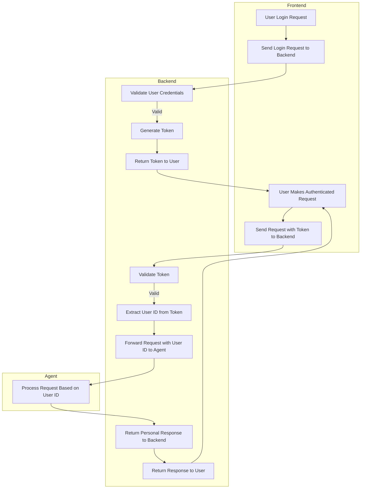

## Request & Response Examples
The server provides a simple layer for managing agent processes.

### API Resources

  - [POST /start](#get-magazines)
  - [POST /stop](#get-magazinesid)
  - [POST /ping](#post-magazinesidarticles)


### POST /start
This api starts an agent with given graph and override properties. The started agent will join into the specified channel, and subscribe to the uid which your browser/device's rtc use to join.

| Param        | Description                                                                                                                                               |
|--------------|-----------------------------------------------------------------------------------------------------------------------------------------------------------|
| request_id   | any uuid for tracing purpose                                                                                                                              |
| channel_name | channel name, it needs to be the same with the one your browser/device joins, agent needs to stay with your browser/device in the same channel to communicate |
| user_uid     | the uid which your browser/device's rtc use to join, agent needs to know your rtc uid to subscribe your audio                                              |
| bot_uid      | optional, the uid bot used to join rtc                                                                                                                     |
| graph_name   | the graph to be used when starting agent, will find in property.json                                                                                       |
| properties   | additional properties to override in property.json, the override will not change original property.json, only the one agent used to start                  |
| timeout      | determines how long the agent will remain active without receiving any pings. If the timeout is set to `-1`, the agent will not terminate due to inactivity. By default, the timeout is set to 60 seconds, but this can be adjusted using the `WORKER_QUIT_TIMEOUT_SECONDS` variable in your `.env` file. |

Example:
```bash
curl 'http://localhost:8080/start' \
  -H 'Content-Type: application/json' \
  --data-raw '{
    "request_id": "c1912182-924c-4d15-a8bb-85063343077c",
    "channel_name": "test",
    "user_uid": 176573,
    "graph_name": "camera_va_openai_azure",
    "properties": {
      "openai_chatgpt": {
        "model": "gpt-4o"
      }
    }
  }'
```

### POST /stop
This api stops the agent you started

| Param    | Description |
| -------- | ------- |
| request_id  | any uuid for tracing purpose    |
| channel_name | channel name, the one you used to start the agent  |

Example:
```bash
curl 'http://localhost:8080/stop' \
  -H 'Content-Type: application/json' \
  --data-raw '{
    "request_id": "c1912182-924c-4d15-a8bb-85063343077c",
    "channel_name": "test"
  }'
```


### POST /ping
This api sends a ping to the server to indicate connection is still alive. This is not needed if you specify `timeout:-1` when starting the agent, otherwise the agent will quit if not receiving ping after timeout in seconds.

| Param    | Description |
| -------- | ------- |
| request_id  | any uuid for tracing purpose    |
| channel_name | channel name, the one you used to start the agent  |

Example:
```bash
curl 'http://localhost:8080/ping' \
  -H 'Content-Type: application/json' \
  --data-raw '{
    "request_id": "c1912182-924c-4d15-a8bb-85063343077c",
    "channel_name": "test"
  }'
```


## User management
### Data Model
Create a `User` struct with fields such as `ID`, `name`, `email`, `passwordHash`, `isArchived`, etc. Define a `UserStore` interface for easy swapping of storage implementations.

### In-Memory Store
Implement the `UserStore` interface using a map or `sync.Map`.

### Service Layer
Provide functions for creating, updating, archiving, logging in, logging out, and registering users.

### HTTP Handlers
Bind request data, call service methods, and output JSON responses.

### Routes
- `POST /users` - Create a user
- `PUT /users/:id` - Update a user
- `DELETE /users/:id` - Archive a user
- `POST /login` - Log in a user
- `POST /logout` - Log out a user
- `POST /register` - Register a user

### Test
#### Create User
curl -X POST -H "Content-Type: application/json" \
-d '{"name":"Alice","email":"alice@example.com","password":"1234"}' \
http://localhost:8080/users

#### Get User
curl -X GET http://localhost:8080/users/<USER_ID>

#### Update User
curl -X PUT -H "Content-Type: application/json" \
-d '{"name":"Alice Updated","email":"alice@example.com","password":"9876"}' \
http://localhost:8080/users/<USER_ID>

#### Archive User
curl -X DELETE http://localhost:8080/users/<USER_ID>

#### Register User
curl -X POST -H "Content-Type: application/json" \
-d '{"name":"Bob","email":"bob@example.com","password":"abcd"}' \
http://localhost:8080/register

#### Login
curl -X POST -H "Content-Type: application/json" \
-d '{"email":"alice@example.com","password":"1234"}' \
http://localhost:8080/login

#### Logout
curl -X POST -H "Authorization: <TOKEN_FROM_LOGIN>" http://localhost:8080/logout

#### Verify Token
curl -X POST -H "Authorization: <TOKEN_FROM_LOGIN>" http://localhost:8080/token/verify

### Flow
